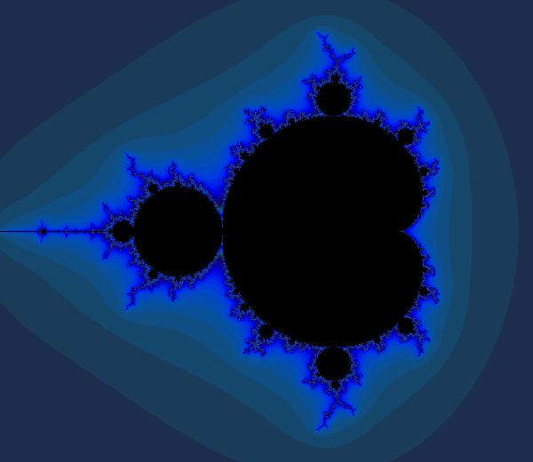

# 曼德布洛特(Mandelbrot)集合 <a class="md-anchor" id="AUTOGENERATED-mandelbrot-set"></a>
虽然可视化曼德布洛特(Mandelbrot)集合与机器学习没有任何关系，但这是将TensorFlow应用在基础数学上的一个有趣的例子。这是一个有趣简单的可视化的实现。（我们将提供一个更复杂的实现来产生更多真正美丽的图像）。

说明：本教程使用了IPython的notebook。

## 基本步骤 <a class="md-anchor" id="AUTOGENERATED-basic-setup"></a>

开始时，我们需要导入一些库。

```python
# 导入仿真库
import tensorflow as tf
import numpy as np

# 导入可视化库
import PIL.Image
from cStringIO import StringIO
from IPython.display import clear_output, Image, display
import scipy.ndimage as nd
```

现在我们将定义一个函数来显示迭代计算出的图像。

```python
def DisplayFractal(a, fmt='jpeg'):
  """显示迭代计算出的彩色分形图像。"""
  a_cyclic = (6.28*a/20.0).reshape(list(a.shape)+[1])
  img = np.concatenate([10+20*np.cos(a_cyclic),
                        30+50*np.sin(a_cyclic),
                        155-80*np.cos(a_cyclic)], 2)
  img[a==a.max()] = 0
  a = img
  a = np.uint8(np.clip(a, 0, 255))
  f = StringIO()
  PIL.Image.fromarray(a).save(f, fmt)
  display(Image(data=f.getvalue()))
```

## 会话和变量初始化 <a class="md-anchor" id="AUTOGENERATED-session-and-variable-initialization"></a>

为了达到这样的目的，我们常常使用交互式会话，但普通会话也能正常使用。

```python
   sess = tf.InteractiveSession()
```

非常便捷的是我们可以自由的混合使用NumPy和TensorFlow

```python
# 使用NumPy创建一个在[-2,2]x[-2,2]范围内的2维复数数组

Y, X = np.mgrid[-1.3:1.3:0.005, -2:1:0.005]
Z = X+1j*Y
```

现在我们定义并初始化一个TensorFlow的tensors。

```python
xs = tf.constant(Z.astype("complex64"))
zs = tf.Variable(xs)
ns = tf.Variable(tf.zeros_like(xs, "float32"))
```

TensorFlow在使用之前需要明确的初始化初值。

```python
tf.initialize_all_variables().run()
```

## 定义并运行计算<a class="md-anchor" id="AUTOGENERATED-defining-and-running-the-computation"></a>

现在我们指定更多的计算...

```python
# 计算一个新值z: z^2 + x
zs_ = zs*zs + xs

# 我们使用这个新值分形么？
not_diverged = tf.complex_abs(zs_) < 4

# 更新zs并且迭代计算。
#
# 说明：在分形之后我们继续计算zs，这个计算消耗特别大！
#      如果稍微简单点，这里有更好的方法来处理。
#
step = tf.group(
  zs.assign(zs_),
  ns.assign_add(tf.cast(not_diverged, "float32"))
  )
```

...继续执行几百步步骤

```python
for i in range(200): step.run()
```

让我们看看我们得到了什么。

```python
DisplayFractal(ns.eval())
```




不错！

> 原文：[Mandelbrot Set](http://tensorflow.org/tutorials/mandelbrot/index.md)  翻译：[ericxk](https://github.com/ericxk)  校对：[](https://github.com/)
